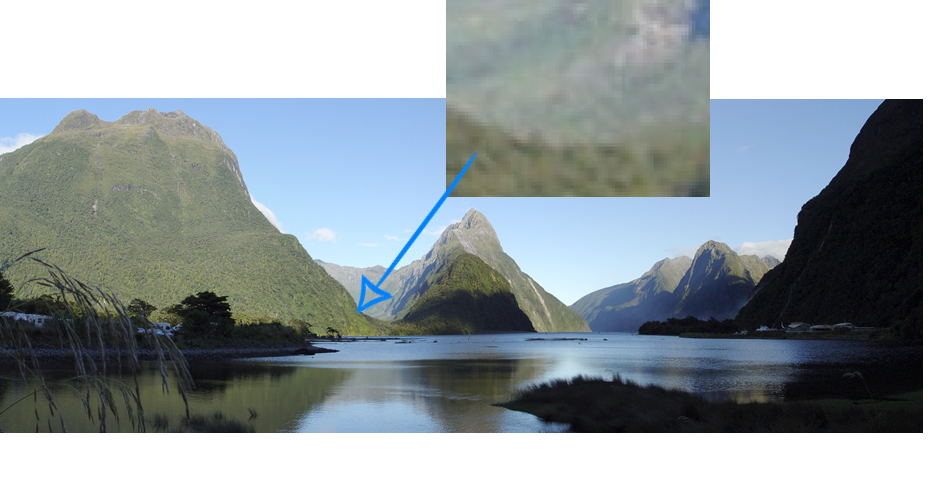
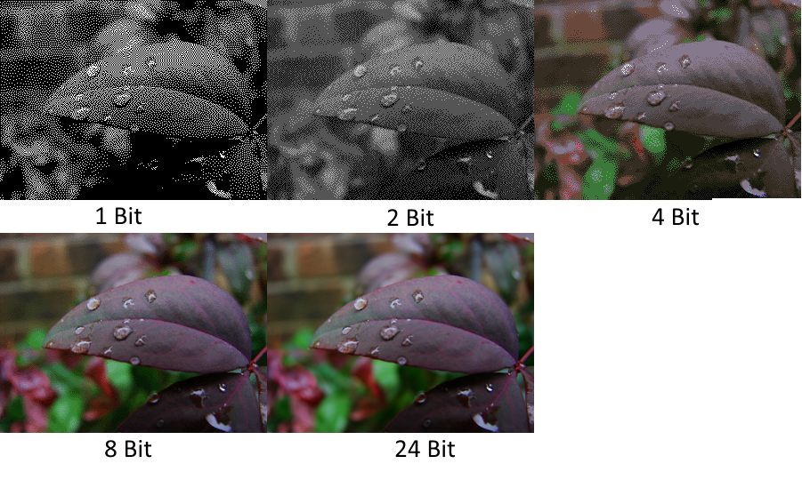
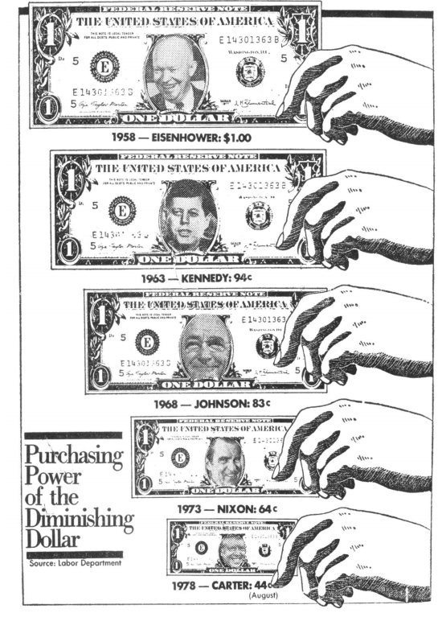

---
title: Introduction to Visualization
layout: slideshow
slides:

    - content: |

        # Introduction to Graphs and Visualization 

    - content: |
        ## How are images stored?
        Vector and raster graphics

      notes: |
        It's important that you have a basic understaning of how images are stored

    - content: |
        ## Raster graphics
        
      notes: |
        We see an example of a raster graphic every time we see a photo
        alpha channel. 

        When we look at the picture of the Milford sound on the slide, and keep zooming in, you can start to distinguish the indiviudal pixels.

        There is quite a large amount of data in a photo or raster image.

        compression

    - content: | 
        ## Bit depth/Colour depth
        

      notes: |
        A important quality of raster images is the bit depth. The bit depth or colour depth is the number of bits used to indicate level of colour for each colour in a pixel.  

        With each bit having a value of one or zero, we can work out the number of shades available by taking two to the power of the bit depth. So two 2 has 4 shades available and 8 bits has 256 shades.       

        As the bit depth of the image increases so does the richness of the colour palette of an image. Looking at the image on the slide, you can see an how the picture looks richer and smoother as the colour depth goes up.     

        As a point of reference, a typical jpeg file has a colour depth of 8 buts, but some high end systems will to go 30 bits per channel or higher.

    - content: |
        ## File formats
        + Compressed and uncompressed formats i.e JPEG and PNG
        + Image fidelity vital -> don't compress
        + Intermediate workflow -> don't compress 
          
      notes: |

        Once you have created an image of some sort, an important consideration is what format should you save it in?

        Perhaps the main question to ask is, do I want a perfect rendition of the image I have created? There are two categories of image formats, lossy and lossless. 

        Jpeg is a good example of a lossy format. When you save something in jpeg, you will permanently lose some of the information as it tries to make the image file smaller. A lossless format can try and compress the file size down but not at the cost of the loss of information. PNG is a good example of a lossless format.

        The picture on the slide of the cat shows how the level of compression (and distortion) can vary. The left hand side of the picture is very heavily compressed, and the right hand side has very little compression. You can see how the image quality increases as the level of compression decreases.

        JPEG is good with smooth changes in colour, rapid changes, such as lines on a graph, can lead to ugly artefacts. JPEG is good at compressing "natural" images such as photos of landscapes.  

        To put all this in the context of you scientific workflow:
        If you want perfect reproduction of an image (or as close to as possible) save images in a lossless format.

        IF you are compressing image files, wait until the end of your workflow to do so. Compress once. Repeated compression will degrade your image quality.

    - content: |
        ## Vector graphics
        + Polygons rather than pixels
        + Can scale up as small or large as we want -> rasterize
        \

      notes: |
        So we have seen that raster graphics are graphics composed of a grid of pixels. Vector graphics on the other hand are made up of parametrized shapes such polygons and splines. Polygons are shapes that can be created by bounding an area by straight lines, more simply triangle, squares and shapes made by combing them etc. Splines are curves generated from a mathematical expression. 

        The difference between vector and raster graphics becomes clear when we need to scale an image up. Thinking back to what happened when we scaled up the raster image a few slides back, the individual pixels became more and more visible. Likewise the shapes that make up a vector graphic will increase in size, but this doesn't lead to a drop in fidelity. Vector graphics also allow for colour gradients, which means we can smoothly transition from one colour to another, regardless of the scale.

        To display an vector graphic on a screen, it has to be rasterized, screens display images in pixels, so ultimately a vector graphic has to be converted for it to be displayed. 

        In a way, raster graphics are a special case of vector graphics, made up of only coloured squares, without any other shapes. 

    - content: |
        ## Some sort of computational exercise where they play around with colour and bit depth

    - content: |
        # Colour
      notes: |
        An extremely important technical aspect of visualization is how do we represent colour? What is a computational representation of colour that we can store and manipulate?

    - class: center-aligned
      background-image: https://upload.wikimedia.org/wikipedia/commons/a/af/RGB_color_solid_cube.png
      background-size: 30%
      background-position: 80%
      content: |
        ## Modelling Colour

        * RGB Colour Model
        * Represents colour as a triple (R,G,B)
        * What most displays use 
        * Device independent implementation
        {:.left-aligned}
      notes: |

    - class: center-aligned
      background-image: https://upload.wikimedia.org/wikipedia/commons/0/0d/HSV_color_solid_cylinder_alpha_lowgamma.png
      background-size: 30%
      background-position: 70%
      content: |
        ## Modelling Colour

        * HSV/HSL Colour Model
        * Designed to be more intuitive than RGB
        * Can convert perfectly back and forth to RGB
        * Represents colour as a triple (H,S,V)

        
    - class: center-aligned
      background-image: https://upload.wikimedia.org/wikipedia/commons/f/f9/CMYK_channels_skala.jpg
      background-size: 30%
      background-position: 70%
      content: |
        ## Modelling Colour

        * Other colour models exist that cover wider range of colour
        * CMYK - 4 channels - used in print

    - content: |

        ## What is Visualization? 

        + It is based on (non-visual) data
        + It produces an image
        + The result is readable and recognizable [Kosara (2007)](http://kosara.net/papers/2007/Kosara_IV_2007.pdf)
            
      notes: |
        Hard to define exactly visualization is. You'll know it when you see it 

    - content: |

        ## Why should we study it?

        * Provide context and link data
        * Develop new insights
        * 

      notes: |
        Effective science communication makes you a better scientist

       
    - class: center-aligned
      background-image: https://upload.wikimedia.org/wikipedia/commons/e/ec/Anscombe%27s_quartet_3.svg
      background-size: 30%
      background-position: 70%
      content: |
        ## New Insights
        Each data set has the same mean and standard deviation

    - content: |

        ## Visualization is an investment

        Effective visualization not only makes your work more understandable to others but to yourself as well.

        Time spent in developing skills in effective visualization will pay itself back many times 

      notes: |
        Over time you will develop a library of techniques that you can use, as well a more literal library of snippets of code that can be re used

    - content: |

        ## Principles of Visualization (From Tufte)

        * Show the data "truthfully", don't distort it
        * Allow the view to understand the most ideas in the shortest time
        * Encourage the viewer to thinking about the form or substance of the data, not the method of display
        * Reveal the structure in the data at a variety of scales
        * Serve a clear purpose within the text or wherever it is displayed
        * Be integrated with other descriptions of the data

    - content: |
        ## The Science of Perception and Visualization

        Human perception important aspect of visualization
        Preattentive processing: low level visual system rapidly processes certain basic features of an image (<200 ms).

        Variety of theories for how and why.

    

    - content: |

        ## The Science of Perception and Visualization

        Pre attentive Processing
           

      notes: |
        How we process visual information has a big impact on designing effective visualizations

    - content: |

        ## The Science of Perception and Visualization

        Pre attentive Processing
           
        

    - content: |

        ## The Science of Perception and Visualization

        ### Further Features
        + Orientation 
        + Size
        + Density 
        {:.left-aligned}

    - content: |
        

    - content: |
        ## Accuracy of visual markers 
        From [Ceveland and McGill](http://www.cs.ubc.ca/~tmm/courses/cpsc533c-04-spr/readings/cleveland.pdf)

        1. Position along a common scale
        2. Positions along non-aligned scales
        3. Length, direction, angle
        4. Area
        5. Volume, curvature
        6. Shading, colour saturation
        {:.left-aligned}
        
      notes: |
        Opinions vary on the exact order

    - content: |
        ## Avoid Chart Junk
        
      notes: |
        This is a bit of an oversimplification. Its okay to make a graphic "junkier" if you feel it needs to be more striking or memorable. It is a trade off.
    - content: |

        ## Avoid distortion

    - content: |

        ## Encoding with size

        Graphic dimension <= Data dimension
        

    - content: |

        ## Small multiples 
              

    - content: |

        ## Small multiples
        

    - content: |
        ## Layering and separating
        

    - content: |
        ## Colour rules
    

    - content: |

        ## Iterate

        + You are probably not going to get it right the first time.

        + What makes sense to you wont necessarily make sense to others. 

      notes: |
        Creating your figures using script in R/Python etc makes iteration very easy.

    - content: |

        ## Tables

        + If you can effectively convey information with a graph, use a graph

        + Tables still have a place, most often as a reference

    - content: |

        ## General rules for using tables
        * Several smaller tables are better than one large table
        * Structure the table for how your audience will use the data
        * Arrange rows and columns by some sort of context - size, name etc

    - content: | 
        ## Use an Anchor figure
        Hilight the principle data points you want compared to the rest of the data
        

    - content: | 
        ## Colour lines
        Improves readability remarkably, especially for larger tables
        

    - content: | 
        ## Combine Tables and Graphs
        Show trends/patterns in data as well as exact values
        

    - content: |
        ## Sparklines   
        Show shape and variation of data 
        

    - content: |
        ## Visualizing high dimensional/ complex data    

        

    - content: |
        ## Visualizing high dimensional/ complex data  
        

    - content: |
        ## Explore your options, there is a whole [zoo](http://queue.acm.org/detail.cfm?id=1805128) of choices out there
        There might not be an established solution yet  ¯\\_(ツ)_/¯ so be creative

--- 