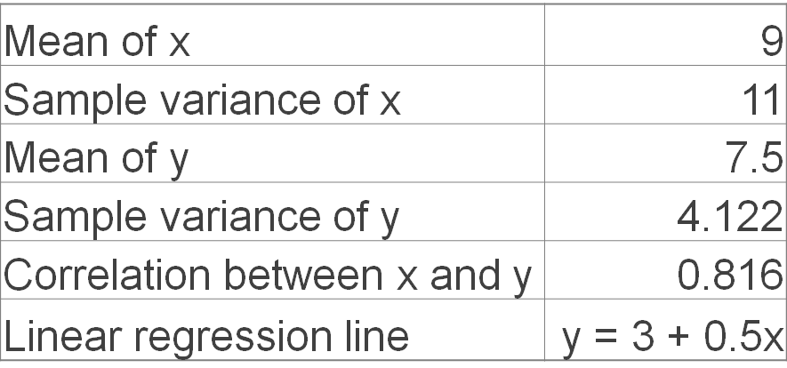

---
title: Introduction to Visualization
layout: slideshow
slides:

    - content: |

        # Introduction to Graphs and Visualization 
        "to make certain phenomena and portions of reality visible and understandable; many of these phenomena are not naturally accessible to the bare eye, and many are not even of visual nature"(Joan Costa)

    - content: |

        ## What is Visualization? 

        + It is based on (non-visual) data
        + It produces an image
        + The result is readable and recognizable [Kosara (2007)](http://kosara.net/papers/2007/Kosara_IV_2007.pdf)
        {:.fragment}
            
      notes: |
        Its hard to to  give an exact definition of what visualization is. You'll know it when you see it. Sorry. 

        At the highest level Information visualization is the graphical representation of data (numerical, text, geographical etc). The data source is not something already visualized, its abstract.

        The requirement of producing an image may be obvious, but the point is that the produced image is the primary way of communication information. If it is secondary to something else, it is not a visualization.  

        When we say the result is readable and recognizable, we are setting a criteria that the visualization is a means to learn something about the underlying data. This is in contrast to "informative/information art", in which images are generated from data where conveying information is not their primary purpose.

        Scientific visualization is mainly concerned with developing representations of three or more dimensional data. For example MRI or an aerodynamics simulation. Scientific visualisations are less abstract than data visualizations.

        We are going to be focussing on Data Visualization, which we will take to mean "information which has been abstracted in some schematic form, including attributes or variables for the units of information " [Friendly](http://www.math.usu.edu/~symanzik/teaching/2009_stat6560/Downloads/Friendly_milestone.pdf). Data visualization encompasses statistical graphics, and plots amongst other things.

        We can think of information visualization as a model. We are trying to abstract our representation of the data while retaining what we think the core truths of the data. There is a famous saying about models, "All models are wrong but some are useful". Lets keep that in mind while we think about and create visualization. 

    - content: |
        ## A quick history

        {:height="480"}

      notes: |

        Data Visualization began to emerge in the 16th century, prior to this data visualization was limited to maps and diagrams.  

        Creation of co-ordinate systems
        Theories in errors of measurement and estimation
        Collection of social and demographic data
        Keeping scientific data in tabular form

    - content: |
        ## A quick history    
        William Playfair invents line, area, bar and pie charts. 
        {:height="480"}

    - content: |
        ## The modern era
        High dimensional, interactive and dynamic  
        {:height="480"}

      notes: |
        Huge increases in computer power and data sets
        New forms still being invented
        Moving bubble charts
        Word clouds
        circos images
        Friednly [2006](http://www.datavis.ca/papers/hbook.pdf) and the milestones in [dataviz](http://datavis.ca/milestones/) website by the same author give a good history of the field

    - content: |

        ## Why should we study it?

        * Provide context and link data
        * Develop new insights
        * Essential part of scientific commuinication
        {:.fragment} 

      notes: |
        "To make certain phenomena and portions of reality visible and understandable; many of these phenomena are not naturally accessible to the bare eye, and many are not even of visual nature"
        Effective science communication makes you a better scientist

        Time spent in developing skills in effective visualization will pay itself back many times.

        Effective visualization not only makes your work more understandable to others but to yourself as well.

        Over time you will develop a library of techniques that you can use, as well a more literal library of snippets of code that can be re used

    - content: |
        ## New Insights - Anscombes quartet
        {:height="480"}

    - content: |
        ## New Insights - Anscombes quartet 
        {:height="400"}

      notes: |
        Pictured on the slide are the graphs of four data sets called Anscombes quartet. Each data set has the same mean and standard deviation, along with variance, correlation and linear regression. So if we were to solely look at the numeric summary statistics  of this data, we could come to the conclusion that they are pretty similar data sets. But by plotting them we can quickly see there are some big differences between the different data sets.

    - content: |

        ## Principles of Visualization (From Tufte)

        * Show the data truthfully, don't distort it
        * Allow the viewer to understand the most ideas in the shortest time
        * Encourage the viewer to thinking about the form or substance of the data, not the method of display
        * Reveal the structure in the data at a variety of scales
        * Serve a clear purpose within the text or wherever it is displayed
        * Be integrated with other descriptions of the data
        {:.fragment}

      notes: |
        These principles are not absolute, but in general are a good guide to what you should and shouldn't do. They are fairly self explanatory, but here are some notes none the less

        Visualization are made with a message in mind, but that message should be a fair representation of what's in the data, not a distortion or exaggeration of anything present.

        When we are creating a visualization we want the viewing to get the message or idea being displayed quickly as well as conveying a depth of information at the same time. There is generally a trade off between speed of information retrieved by the viewer and the level of information shown.

        The particular method of visualization chosen should be almost transparent to the data, when we look at visualization we are drawn to features of the data, not the method used to display it. 

        [SOMETHING ABOUT SCALE]

        With regard to the last two points, a visualization should be part of whatever piece of media it is displayed in. If it is not stand alone piece, it should be part of and integrate with whatever it's in. It should be clear from a glance what it's prupose is and what it's being used for.

--- 