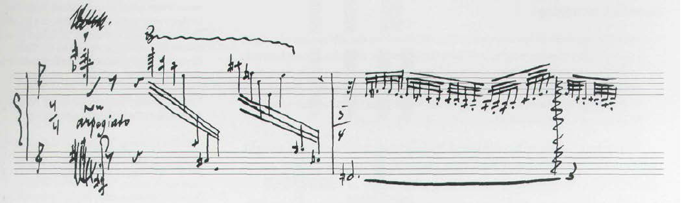

---
layout: slideshow
title: Practical Visualization Techniques
slides:

    - content: | 
        ### Practical Visualization Techniques

    - content: |

        ### Principles of Visualization (From Tufte)

        * Show the data "truthfully", don't distort it
        * Allow the viewer to understand the most ideas in the shortest time
        * Encourage the viewer to thinking about the form or substance of the data, not the method of display
        * Reveal the structure in the data at a variety of scales
        * Serve a clear purpose within the text or wherever it is displayed
        * Be integrated with other descriptions of the data
        {:.fragment}

      notes: |
        These principles are not absolute, but in general are a good guide to what you should and shouldn't do. They are fairly self explanatory, but here are some notes none the less

        Visualization are made with a message in mind, but that message should be a fair representation of what's in the data, not a distortion or exaggeration of anything present.

        When we are creating a visualization we want the viewing to get the message or idea being displayed quickly as well as conveying a depth of information at the same time. There is generally a trade off between speed of information retrieved by the viewer and the level of information shown.

        The particular method of visualization chosen should be almost transparent to the data, when we look at visualization we are drawn to features of the data, not the method used to display it. 

        [SOMETHING ABOUT SCALE]

        With regard to the last two points, a visualization should be part of whatever piece of media it is displayed in. If it is not stand alone piece, it should be part of and integrate with whatever it's in. It should be clear from a glance what it's prupose is and what it's being used for.

    - content: |
        [Napoleon's March](https://en.wikipedia.org/wiki/Charles_Joseph_Minard#/media/File:Minard.png)
    - content: |
        [Napoleon's March (Translated)](https://upload.wikimedia.org/wikipedia/commons/5/5d/Minard_map_of_napoleon.png)
      notes: |
        Forces visual comparisons (the upper lighter band showing the large army going to Moscow vs. the narrow dark band showing the small army returning).
        Shows causality (the temperature chart at the bottom).
        Captures multivariate complexity (size of army, location, direction, temperature, and time).
        Integrates text and graphic into a coherent whole.
        Illustrate high quality content (complete and accurate data, presented to support Minard’s  argument against war).
        Place comparisons adjacent to each other, not sequentially (people forget if they have to go from page to page ).
        Use the smallest effective differences (i.e., avoid bold colors, heavy lines, distracting labels and scales).

    - content: |
        ### Narrative
        notes: |
          Minards chart has an excellent sense of narrative. People often talk about telling a story when creating graphics and visualizations. There is no need to follow this dogmatically but it can help clarify what you are trying to achieve. 
          Guide. Highlight. Interpret.

    - content: |
        ### Avoid Chart Junk
        {: .center-aligned height="400"} 
      notes: |

        Hopefully it is clear what chart junk is by looking at this graphic. Chart junk has been a bit of a contentious term; a safe definition is that it's an embellishment that doesn't add anything to the graphic.

        You could argue that this graphic is visually striking, but the embellishments they have used, over lapping pie graphics and the arrangement of pie graphs across the space of the image, don't add to our understanding of the image, they take away from it. 

        This is a bit of an oversimplification. Its okay to make a graphic "junkier" if you feel it needs to be more striking or memorable. It is a trade off.
    - content: |

        ### Avoid distortion

    - content: |

        ### Encoding with size

        Graphic dimension <= Data dimension
        

    - content: |
        ### Avoid overplotting
        

      notes: |
        When we are creating graphs such as scatter and line graphs, we can end up having data that occupies the same space in the chart because the data points are close or identical in value. If our data set is quite large or doest vary much we can end up plotting blobs of indistinguishable data. 

        If we want to continue plotting all the data points we have a few options.

        * Reduce marker size
        * Change marker shape
        * Marker transparency
        * Jitter

        The other options is to change the number of data points we are plotting. We could do this in a number of ways. We can combine or aggregate the data in some way, using the mean or median for example.

        We could break up the data into sub plots using small multiples (see next slide)

        Or, potentially you could statistically sample the data and plot the sample.

    - content: |

        ### Small multiples 
        {: .center-aligned height="400"}       

    - content: |

        ### Small multiples
        {: .center-aligned height="400"} 

        Small multiples is a very simple but powerful technique. With small multiples we are taking a data set, and splitting up/disaggregating it by categories we are interested in. 

        In the example shown we have a [] graph, but we are not limited to using only the standard suite of graphs. Small multiples can be used with all varieties of techniques, social network visualizations, maps, whatever. 

        WHen using small multiples, you need to be conscious that each individual graph isn't overtly complicated. Comparisons between each graph become quite difficult otherwise. 

    - content: |
        ### Layering and separating
        

    
    - content: |
        ### The F pattern
        [The F pattern](https://media.nngroup.com/media/editor/alertbox/f_reading_pattern_eyetracking.jpg)
        notes: |
        When we read formatted text (Headings, paragraphs etc) we read it in a F pattern (if we read left to right otherwise it is the reverse. Pictured is a website with a heat map of where users look on the website, from tracking their eyes. The areas most frequently looked at follow a F pattern. This is now a very common pattern for how content is arranged in websites.

        If you have information arranged on the page that want to reader to focus on, you need a way of drawing readers attention to it 

        

    - content: |

        ### Iterate

      notes: |
        You are probably not going to get it right the first time. Creating your figures using script in R/Python etc makes iteration very easy. Changing the various graphical elements of a figure is very quick, and unlike say excel easily revertible, its just code. 

        What makes sense to you wont necessarily make sense to others. Just as you have others read over your work to check that the text flows and is free of errors, the same should be done for graphics you create. Validate your design decisions, particularly on more complex graphics. 

        

        

    - content: |
        ### Aesthetics

      notes: |
        Don't be afraid of spending time to make your graphics look nice beyond the point of a serviceable level of attractiveness. Graphics are not just something you throw into a report and then forget about them. 

         Going beyond this point inst [something], Make graphics that people want to look at. 

    - content: |
        ### Consistency
        notes: |
        Having effective, individual, graphics is great but they can lose their effectiveness a whole if there is no consistency in design from graphic to graphic. 

        We don't want the view to want to have to re learn encodings when viewing different graphic. Consistency will encourage familiarity. Remember that we are primed to notice differences. We want the view to notice differences in the data, not the medium. 

        Stick to your "Style Guide".

    - content: |
        ### Using space effectively

        

      notes: |
        Bank to 45 degrees - maximize disrimability. Broad heuristic. Get correct aspect ratio from this. Obviously you may have to make concessions for where graphic will end up based on formatting. 
        Transform data - log etc. Depending on data being displayed. Avoid scale breaks

    - content: |

        ### Tables

        * If you can effectively convey information with a graph, use a graph
        * Tables still have a place, most often as a reference

    - content: |

        ### General rules for using tables
        * Several smaller tables are better than one large table
        * Structure the table for how your audience will use the data
        * Arrange rows and columns by some sort of context - size, name etc

    - content: | 
        ### Use an Anchor figure
        Hilight the principle data points you want compared to the rest of the data
        {: .center-aligned height="400"} 

    - content: | 
        ### Colour lines
        Improves readability remarkably, especially for larger tables
        

    - content: | 
        ### Combine Tables and Graphs
        Show trends/patterns in data as well as exact values
        {: .center-aligned height="400"} 

    - content: |
        ### Sparklines   
        Show shape and variation of data 
        

    - content: |
        ### Visualizing high dimensional/ complex data    

        {: .center-aligned height="400"} 

    - content: |
        ### Visualizing high dimensional/ complex data  
        {: .center-aligned height="400"} 

    - content: |
        ### Explore your options, there is a whole [zoo](http://queue.acm.org/detail.cfm?id=1805128) of choices out there
        There might not be an established solution yet  ¯\\_(ツ)_/¯ so be creative
      notes: |
        http://www.visual-literacy.org/periodic_table/periodic_table.html#

---