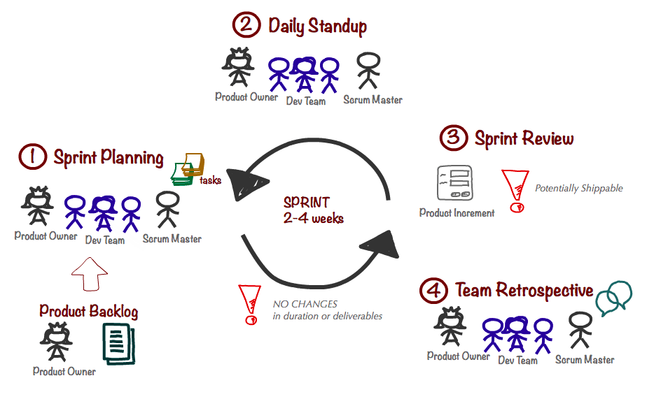
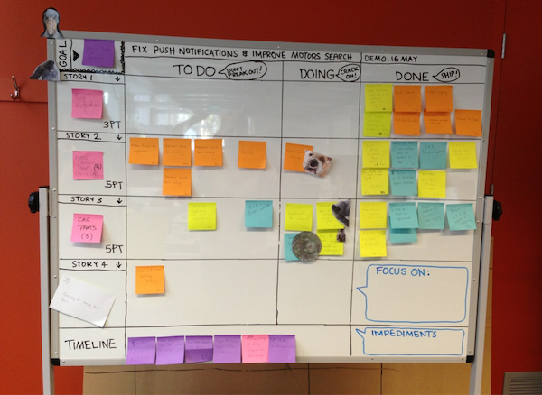

---
layout: slideshow
title: Sprints

slides:

  - content: |

      # Sprints

  

  - content: |

      ## The Sprint Cycle

      {: height="500"}

      

    notes: |

      **Once at start of sprint:**
      1. Sprint planning meeting

      **Daily:**
      2. Daily Standup
      3. Work

      **Once at end of sprint:**
      4. Sprint Review
      5. Team Retrospective

      Image Credit: [Nomad8](http://nomad8.com/how-to-run-a-sprint-planning-meeting-the-way-i-like-it/)

  - content: |

      ## Sprint Planning

      This meeting is used to **define the sprint goal**, 
      **select user stories** and **create tasks** for them.

    notes: |

      Meeting purpose: Plan and prepare for the upcoming sprint
      Meeting duration: ca. 1 hour for a 2 week sprint (it will be less if you’re an experienced team and know your domain well)

  - content: |

      _Sprint Planning Part 1_

      ## Sprint Goal and User Stories

      Decide on a sprint goal, then select user stories
      which support the achievement of that goal.

    notes: |

      Identifying a sprint goal up-front helps the team prioritise user stories by selecting those which best support the goal.

      Next decide how many story points you want to achieve this sprint. Take into consideration any public holidays, team members taking leave, or other external factors which may reduce time availability. This judgement gets easier each sprint, as you get a better idea of how many points the team regularly achieves.

      Look at the product backlog and select the stories to be scheduled in the sprint. Mainly consider the sprint goal, but also whether there may be room for a secondary goal, or a need to prioritise high-risk items ahead of time. Remember to leave so wiggle room for unexpected problems (or opportunities!).

  - content: |

      _Sprint Planning Part 2_

      ## Task Planning

      Once the stories have been selected, 
      break them down into simpler tasks.

    notes: |

      If you find it hard to make tasks ask yourself how you would get started. And what you would do next? And then? You’ll find you can come up with quite a lot of useful tasks that need to be done.
 
      Try to keep tasks to less than a full day’s work so that stuff moves through on a daily basis and there is a sense of progress and opportunity for collaboration during the daily standup. Also, try to split them in a way so that in theory different people could do different tasks.
      
      Remember that you don’t need to get the tasks right upfront: It’s perfectly fair to add new tasks to a story or to delete tasks that are no longer needed during the sprint.
      
      And don’t assign tasks upfront! It will just make you wait for each other and cheat you for opportunities to collaborate and help each other.

      Content Credit: [Nomad8](http://nomad8.com/how-to-run-a-sprint-planning-meeting-the-way-i-like-it/)

  

  - content: |

      _Sprint Planning Part 3_

      ## Work Visualisation

      {: height="300"}

      Display your stories, tasks, and progress in a central place
      where all team members can easily view the work in progress.
  
    notes: |

      If you aren’t co-located you can of course achieve the same in Jira or some other tool. I really like the tactile and highly visible nature of the post-it note board though, so if you have the option I’d definitely use one of these.

      Image and Content Credit: [Nomad8](http://nomad8.com/how-to-run-a-sprint-planning-meeting-the-way-i-like-it/)

  - class: left-align
    style: |
      padding: 0 150px;
    content: |

      ## Daily Standup

      During the daily scrum, each team member 
      answers the following three questions:

      - What did you do yesterday?
      - What will you do today?
      - Are there any impediments in your way?

    notes: |

      This is a daily meeting where every team member gives a brief report of what they're up to, not exceeding 2 minutes.

      Everybody answers the same 3 questions.

      By focusing on what each person accomplished yesterday and will accomplish today, the team gains an excellent understanding of what work has been done and what work remains. The daily scrum meeting is not a status update meeting in which a boss is collecting information about who is behind schedule. Rather, it is a meeting in which team members make commitments to each other.

      Source [Mountain Goat Software: Daily Scrum](https://www.mountaingoatsoftware.com/agile/scrum/daily-scrum)

  - content: |

      ## Daily Work

      Developers do work each day on one or more tasks. 
      
      They may update the scrum board during the day, 
      but they **must** before daily standup.

  - content: |

      ## Sprint Review

      This meeting is used to share what was achieved during a sprint.

      During review, the project is assessed against the 
      sprint goal determined during the sprint planning meeting.

    notes: |

      The sprint review meeting is intentionally kept very informal, typically with rules forbidding the use of PowerPoint slides and allowing no more than two hours of preparation time for the meeting. A sprint review meeting should not become a distraction or significant detour for the team; rather, it should be a natural result of the sprint.

      Participants in the sprint review typically include the product owner, the Scrum team, the ScrumMaster, management, customers and developers from other projects.

      During the sprint review, the project is assessed against the sprint goal determined during the sprint planning meeting. Ideally, the team has completed each product backlog item brought into the sprint, but it's more important that they achieve the overall goal of the sprint.
      
      Credit: [Mountain Goat Software](https://www.mountaingoatsoftware.com/agile/scrum/sprint-review-meeting)

  - content: |

      ## Sprint Retrospective

      This meeting is used to review the sprint from a team perspective.

      The Scrum Master facilitates the meeting and guides team members
      in discussing what went well and what could be done differently.

---